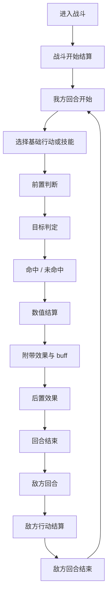

# 战斗流程说明

本文档描述当前版本的完整战斗流程，按现有代码实现整理。  
默认以 `BattleService` 的实时战斗为主，`CombatEngine` 的自动模拟遵循同一套核心规则。

## 一、战斗入口

1. 进入战斗前，系统先根据关卡生成敌人编队，并把敌人数据转换为运行时战斗单位。
2. 初始化双方战斗状态，包括生命、护甲、格挡、闪避层数、技能冷却、被动状态和回合计数。
3. 战斗开始时，会先结算战斗开场效果，再触发战斗开始类状态。
4. 如果敌方存在“先手”类特性，战斗开始后会先结算一次敌方行动，再进入我方第 1 回合。

## 二、完整回合顺序

## 三、我方回合

### 1. 回合开始

我方每回合开始时，先进行这些处理：

- 清空本回合的临时标记。
- 结算持续伤害或回合开始类效果。
- 触发回合开始状态。
- 重置或刷新本回合相关资源，例如需要重置的格挡和连携计数。

### 2. 选择行动

我方可执行的行动分为两类：

- 基础行动：普通攻击、防御、闪避。
- 四个技能槽中的主动技能：按技能数据里的 `type` 执行，可能是攻击、防御、闪避、治疗、增益、减益、召唤、嘲讽、姿态或其他效果。

### 3. 行动前置判断

在真正发动行动前，会先检查：

- 当前是否仍处于战斗阶段。
- 是否满足本回合行动条件。
- 技能槽是否有技能。
- 技能是否在冷却中。
- 当前能量是否足够。
- 目标是否有效。

不同技能类型还会有额外判断：

- 攻击技能：必须能找到有效目标。
- 治疗技能：必须选择有效友方目标。
- 召唤、嘲讽、姿态类技能：按技能自身规则处理。

## 四、目标与命中判定

### 1. 目标选择

攻击和减益类技能会先对目标做有效性修正，主要考虑：

- 嘲讽目标优先。
- 隐蔽单位在场上有可见单位存活时，不应成为主要目标。
- 后排单位在前排仍存活时，可被规则保护。

### 2. 命中定义

当前实现里，“命中”指：

- 没有被闪避层完全抵消；
- 不是完全免伤或完全无效；
- 即使被格挡或护甲减伤，也仍然算命中。

因此：

- 闪避成功 = 未命中；
- 被格挡但仍造成部分伤害 = 命中；
- 伤害为 0 的真正未命中，才算失败。

## 五、数值结算

### 1. 基础攻击类

普通攻击和攻击技能通常按以下顺序计算：

1. 先取角色当前攻击力。
2. 再叠加状态、装备、技能附着和临时倍率。
3. 再乘以技能倍率或段数倍率。
4. 所有最终伤害统一向上取整。

### 2. 护甲与格挡

伤害结算顺序为：

1. 先结算护甲减伤。
2. 再结算格挡吸收。
3. 剩余伤害再扣生命。

当前规则里：

- 护甲可以为负数，负数会自然放大最终承伤。
- 格挡是单独的格挡值，不等同于护甲。
- 真伤不受护甲影响，但仍会受格挡影响。

### 3. 闪避

若目标存在闪避层：

- 本次伤害直接被抵消。
- 消耗 1 层闪避。
- 这次打击不继续进入护甲与格挡结算。

## 六、基础行动

### 1. 普通攻击

普通攻击是最基础的攻击行为，流程是：

1. 读取当前攻击力。
2. 对目标进行命中判定。
3. 命中后计算护甲、格挡和最终伤害。
4. 触发命中相关被动、状态和后置效果。

普通攻击会触发：

- 命中类被动；
- 受到命中后的触发器；
- 技能或装备上的额外效果；
- 群袭协攻类效果。

### 2. 防御

防御会根据格挡值提升当前格挡。

- 基础格挡来源于格挡值。
- 防御技能可按倍率或附加值提高格挡。
- 防御一般不直接造成伤害，但会影响后续承伤。

### 3. 闪避

闪避会增加闪避层数。

- 下一次受到命中的攻击会先消耗闪避层。
- 闪避成功后，后续同一段攻击会继续按剩余层数判定。
- 某些技能会附带额外格挡或其他修饰。

## 七、四个主动技能槽

四个技能槽里的技能都按数据表驱动，不固定为某一种效果。  
技能最终归类由 `type` 决定，常见类型包括：

- `attack`：攻击技能
- `defense` / `stance`：防御或姿态技能
- `dodge`：闪避技能
- `heal`：治疗技能
- `buff`：增益技能
- `debuff`：减益技能
- `summon`：召唤技能
- `taunt`：嘲讽技能
- `duel`：单挑技能
- `deflect`：偏转技能

### 1. 攻击技能

攻击技能会先算基础伤害，再按技能倍率结算。

常见后续效果包括：

- 破甲；
- 溅射；
- 打断；
- 降低目标攻击；
- 造成持续伤害；
- 触发命中类被动。

### 2. 防御 / 姿态技能

防御或姿态技能通常会：

- 提升格挡；
- 设置反击状态；
- 产生后续回合生效的防守效果；
- 部分技能会额外附带护甲相关效果。

### 3. 闪避技能

闪避技能通常会：

- 增加闪避层；
- 可能附带额外格挡；
- 可能受到状态卡或附着效果影响。

### 4. 召唤 / 嘲讽 / 单挑 / 偏转

这些技能不一定直接造成伤害，但会强烈改变战斗节奏：

- 召唤：生成新单位，新单位默认下一回合才能行动。
- 嘲讽：改变敌我目标优先级。
- 单挑：锁定单一目标，限制其他敌人的影响。
- 偏转：临时免疫敌方攻击并反弹伤害。

## 八、命中后的附加处理

一旦命中，会继续结算以下内容：

1. 触发命中类被动。
2. 触发目标受击类被动。
3. 施加减益或易伤。
4. 施加持续伤害、护甲削弱或格挡修改。
5. 触发反击、反伤、连携和群袭协攻。

### 常见 buff / debuff 处理

- `stack: replace`：刷新，不叠加。
- `stack: stack`：叠加。
- `duration`：持续回合数。
- `tick_effects`：每回合结算。
- `triggers`：满足事件条件后触发。

## 九、敌方回合

敌方回合的顺序如下：

1. 先检查裂变。
2. 再检查召唤。
3. 清空敌方格挡和嘲讽。
4. 触发敌方回合开始状态。
5. 逐个结算敌方行动。
6. 触发敌方回合结束状态。
7. 结算回合结束通用效果。
8. 进入下一我方回合。

### 1. 敌方行动选择

敌方技能选择由行为规则和权重共同决定，不是逐个怪物写死某个固定技能：

- 有 `behavior_weights` 时，优先按可用技能权重随机选择。
- 技能是否可用，会检查冷却、是否允许独自行动、是否要求有存活队友等条件。
- 没有权重时，再走通用意图规则。

实现上，`EnemyActionRules` 负责决定“选什么”，`BattleService` / `CombatEngine` 负责按技能 `type` 执行。少数特殊行为会在代码里按类型分支处理，但技能本身仍然来自数据表。

### 2. 技能执行分支

敌方技能执行按技能 `type` 分支，常见分支如下：

- `attack`：攻击类，先算伤害，再结算命中、护甲、格挡和附带效果。
- `defense` / `stance`：防御类或姿态类，提升格挡，部分技能会额外启用反击或暗影护甲。
- `dodge`：闪避类，获得闪避层，部分技能会附带额外格挡。
- `summon`：召唤类，生成新单位；新单位默认下一回合才能行动。
- `taunt`：嘲讽类，提升格挡并设置嘲讽层。
- `heal`：治疗类，恢复自身或友军生命。
- `buff` / `debuff`：增益或减益类，直接挂状态。
- `duel`：单挑类，锁定单一目标并屏蔽其他敌人的攻击影响。
- `deflect`：偏转类，临时免疫攻击并反弹伤害。

少数特殊敌方行为也会在这里额外做数据分支处理，例如 `enemy_shadow_armor` 会在防御时打开暗影护甲状态。

### 3. 敌方攻击命中流程

敌方攻击和我方攻击共用同一套命中与伤害结算逻辑：

- 先算攻击段数。
- 再算是否被闪避。
- 再算护甲、格挡和最终伤害。
- 命中后触发对应被动、状态和反伤。

### 4. 敌方技能后置效果

敌方技能在命中后可能附带：

- 施加标记或诅咒；
- 获得格挡；
- 获得闪避；
- 召唤小鼠或其他单位；
- 施加暗影护甲；
- 设置反击或持续增益。

## 十、回合结束

每个完整回合结束时，还会统一结算这些内容：

- 持续伤害与持续治疗。
- 回合结束触发器。
- 场地效果。
- 首领类全场效果。
- 需要在下回合生效的召唤物或分裂体延迟行动。

## 十一、与当前实现直接相关的关键点

- 所有伤害统一向上取整。
- 新出现的召唤物和分裂体都要等到下一回合才能行动。
- 诅咒和标记都采用刷新不叠加。
- 隐蔽、深渊沟通、暗影护甲、毒雾、裂变、召唤、群袭、先手都已经接入当前战斗流程。
- 真实战斗与自动模拟遵循同一套核心规则。
