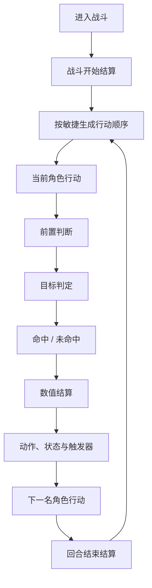

# 战斗流程说明

本文档描述当前版本的实时战斗流程，按现有代码实现整理。

## 一、战斗入口

1. `PlaySession._start_current_battle()` 根据楼层和战斗序号生成遭遇。
2. `CombatRules` 将玩家、敌人和盟友转换为运行时战斗单位。
3. 初始化生命、护甲、格挡、闪避层、技能冷却、状态和回合计数。
4. 触发战斗开始事件，随后按敏捷生成本回合行动顺序。

## 二、完整回合顺序

玩家不固定先于敌人行动。玩家、敌人和 AI 盟友统一按敏捷排序；同敏捷时按行动优先级和生成顺序处理。

## 三、回合开始与行动

每个回合开始时：

- 递减技能冷却；
- 清理或刷新本回合资源；
- 结算持续伤害、持续效果和回合开始触发器；
- 生成状态卡和本回合行动顺序。

当前行动者只能执行一次行动。玩家行动包括：

- 普通攻击、防御、闪避；
- 血瓶：恢复最大生命值的 `30% + 等级 × 5%`，消耗一次玩家行动和一次血瓶使用次数；
- 四个技能槽中的主动技能。

技能行动前检查技能槽、解锁状态、资源、冷却和目标。治疗技能额外检查友方目标；其他目标条件由技能定义和统一目标规则处理。

## 四、目标与命中

目标选择统一考虑：

- 嘲讽目标优先；
- 有可见单位时，隐蔽单位不能作为普通主要目标；
- 前排存活时，受保护的后排单位不能作为普通主要目标。

命中定义为攻击没有被闪避层完全抵消。格挡或护甲减伤仍属于命中；闪避成功才算未命中。

## 五、数值结算

物理伤害通常按以下顺序结算：

1. 读取当前攻击力和技能倍率；
2. 应用状态、装备、附着和行动修正；
3. 结算护甲减伤；
4. 结算格挡吸收；
5. 扣除剩余生命；
6. 触发命中、受击、击杀和其他事件。

真伤跳过护甲，但仍会经过闪避和格挡。所有最终伤害统一向上取整。

## 六、技能与数据驱动动作

技能的具体效果由技能库字段决定：

- `type` 决定技能类别；
- `actions` 决定动作顺序和目标；
- `effects`、`conditional_effects`、`tick_effects` 定义状态效果；
- `triggers` 定义事件触发节点和后续动作。

`SkillActionService` 读取技能动作，`BattleService` 编排行动，`ActionPipeline` 处理行动上下文中的通用修正，`StatusService` 和 `TriggerService` 处理状态与事件。新增技能不应在流程服务中按技能 ID 写死独立触发顺序。

召唤、嘲讽、单挑、偏转、破甲、溅射、打断和持续伤害都属于技能动作或状态数据的表达范围；其目标、持续时间和生效时点以技能库定义为准。

## 七、行动顺序中的敌方行为

`EnemyActionRules` 根据敌人被动能力、行为权重、生命/状态、冷却和队友条件选择敌方行动。选择完成后，敌方与玩家共用技能动作、伤害、状态和触发器结算入口。

每个行动者执行完成后继续处理下一个行动者。新生成单位是否能在当前回合行动，由运行时单位的可用回合字段决定，不由 UI 或固定的敌方回合流程决定。

## 八、回合结束

当前行动顺序处理完成后：

- 触发存活单位的回合结束事件；
- 结算通用回合结束特性和场地效果；
- 检查战斗胜负；
- 胜利时由 `RewardService`、`RewardApplyService` 和 `RunProgressService` 处理奖励、进度和下一场；
- 失败时由 `RunProgressService` 处理教程重开或单局结束。
